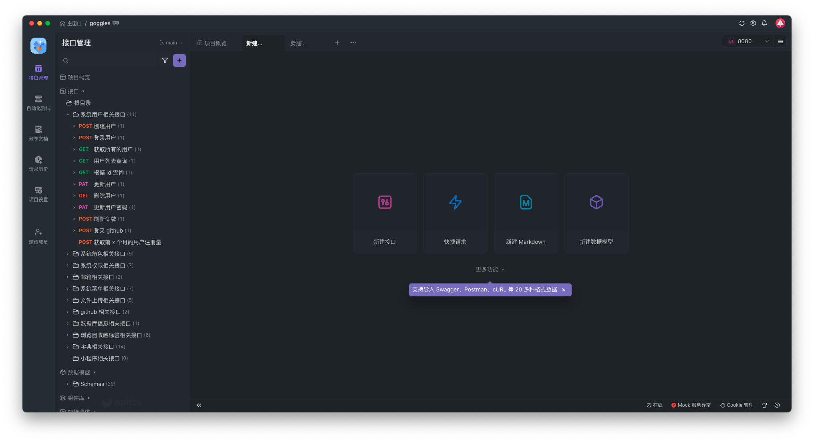
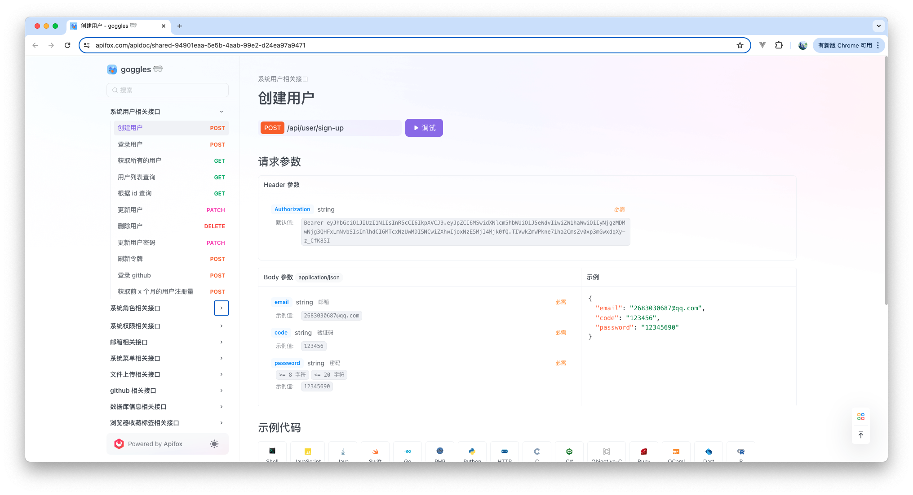

<div align="center" style="display:flex;align-items:center;justify-content:space-around">
  <a href="http://nestjs.com/" target="blank"></a>
</div>

[circleci-image]: https://img.shields.io/circleci/build/github/nestjs/nest/master?token=abc123def456
[circleci-url]: https://circleci.com/gh/nestjs/nest

<p align="center">一个用于构建高效且可扩展的服务器端应用程序的先进的 <a href="http://nodejs.org" target="_blank">Node.js</a>框架</p>
<p align="center">
<a href="https://www.npmjs.com/~nestjscore" target="_blank"></a>
<a href="https://www.npmjs.com/~nestjscore" target="_blank"></a>
<a href="https://www.npmjs.com/~nestjscore" target="_blank"></a>
<a href="https://circleci.com/gh/nestjs/nest" target="_blank"></a>
<a href="https://coveralls.io/github/nestjs/nest?branch=master" target="_blank"></a>
<a href="https://discord.gg/G7Qnnhy" target="_blank"></a>
<a href="https://opencollective.com/nest#backer" target="_blank"></a>
<a href="https://opencollective.com/nest#sponsor" target="_blank"></a>
  <a href="https://paypal.me/kamilmysliwiec" target="_blank"></a>
    <a href="https://opencollective.com/nest#sponsor"  target="_blank"></a>
  <a href="https://twitter.com/nestframework" target="_blank"></a>
</p>

## 描述

[Nest](https://github.com/nestjs/nest) 框架 TypeScript 初始仓库。

## 安装

```bash
$ pnpm install
```

## 运行应用

```bash
# 开发模式
$ pnpm run start

# 监视模式
$ pnpm run start:dev

# HRM webapck 热更新
$ pnpm run dev

# 生产模式
$ pnpm run start:prod
```

## 已有接口预览

**目前已有 60+ 接口，包括登录、角色、用户、权限、菜单、字典和文件上传等**




## 测试

```bash
# 单元测试
$ pnpm run test

# e2e 端到端测试
$ pnpm run test:e2e

# 测试覆盖率
$ pnpm run test:cov
```

## 支持

Nest 是一个 MIT 许可的开源项目。它能够因为赞助商和出色的支持者而发展。如果你想加入他们，请[在此阅读更多](https://docs.nestjs.com/support).

## 保持联系

- 作者 - [Kamil Myśliwiec](https://kamilmysliwiec.com)
- 网站 - [https://nestjs.com](https://nestjs.com/)
- Twitter - [@nestframework](https://twitter.com/nestframework)

## 许可

Nest 使用 [MIT 许可](LICENSE).

#### 日志统计

- 为什么日志统计这么重要？
- 常见日志方案——winston、pino
- 日志如何分类？—— 错误日志、调试日志、请求日志
- 日志记录位置有哪些？分别起什么作用？—— 控制台日志（方便调试）、文件日志（方便回溯与追踪）、数据库日志（敏感操作/数据 记录）
